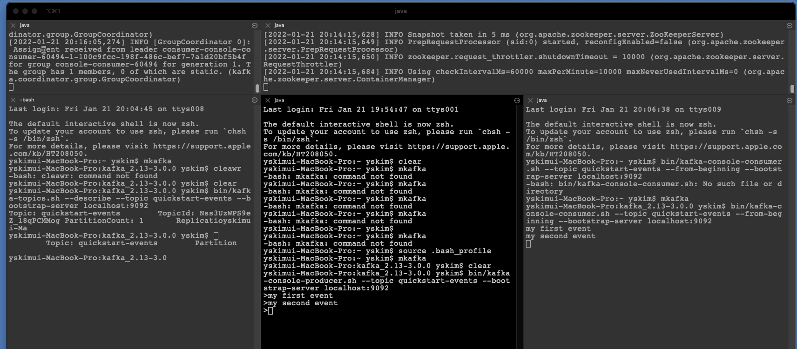

# spring-kafka-learn

## Kafka Quick Start

<https://kafka.apache.org/quickstart>
<https://www.apache.org/dyn/closer.cgi?path=/kafka/3.0.0/kafka_2.13-3.0.0.tgz>

- 원하는 위치에 Kafka( .tgz )를 다운로드

## 환경 시작 및 토픽 생성하기

- Zookeeper와 Config Server를 실행시킨 후
- 토픽 서버를 localhost:9092 포트로 연다.
- 총 3개의 프로세스

```bash
## STEP 1: GET KAFKA
tar -xzf kafka_2.13-3.0.0.tgz
cd kafka_2.13-3.0.0

## STEP 2: START THE KAFKA ENVIRONMENT
# Start the ZooKeeper service
bin/zookeeper-server-start.sh config/zookeeper.properties

# Start the Kafka broker service
# listeners=PLAINTEXT://localhost:9092 | https://stackoverflow.com/questions/47677549/kafka-zookeeper-connection-to-node-1-could-not-be-established-broker-may-no
bin/kafka-server-start.sh config/server.properties

## STEP 3: CREATE A TOPIC TO STORE YOUR EVENTS
# Option zookeeper is deprecated, use --bootstrap-server instead.
bin/kafka-topics.sh --create --partitions 1 --replication-factor 1 --topic quickstart-events --bootstrap-server localhost:9092
```

## Producer 와 Consumer 연동 확인

```bash

## STEP 4: WRITE SOME EVENTS INTO THE TOPIC
bin/kafka-console-producer.sh --topic quickstart-events --bootstrap-server localhost:9092

## STEP 5: READ THE EVENTS
bin/kafka-console-consumer.sh --topic quickstart-events --from-beginning --bootstrap-server localhost:9092
```



## 사용중인 Kafka PID 죽이기

```shell
PIDS=$(ps ax | grep -i 'kafka\.Kafka' | grep java | grep -v grep | awk '{print $1}')

if [ -z "$PIDS" ]; then
  echo "No kafka server to stop"
else
  kill -s TERM $PIDS
fi
```

```bash
# zookeeper & config server stop
bin/kafka-server-stop.sh
```

## References

- <https://victorydntmd.tistory.com/348>
